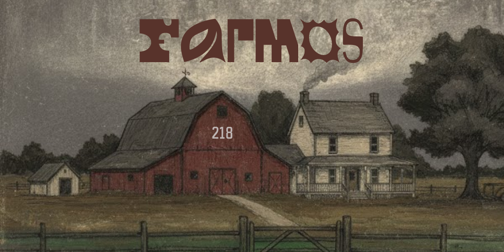

<p align="center">
  
</p>

<h1 align="center">farmOS</h1>

<p align="center">
  by <b>2L8 Sessions</b>
</p>

## Project Structure 
```
farmos/
├── Docs/        # CLI documentation
├── src/
│   ├── app/     # Main executable
│   ├── cli/     # CLI library (static)
│   ├── core/    # Core logic (static)
│   └── deps/    # Dependencies
└── tests/       # Tests
```


## Build 
### Requirements : 
- CMake 3.15+
- C++17-compatible compiler


### Using Make (Recommended)
```bash
make build   # configure and build
make run     # build and run
make test    # build and run tests
make clean   # remove build directory
```

### Manual

```bash
mkdir  build
cmake -S . -B build
cmake --build build 
```
Binary output : `build/src/app/farmos.exe`


####  Running Tests
```
ctest
```
  Ensure the project is built before running tests.

## Documentation
- [CLI Documentation](Docs/cli/Readme.md) — How to attach your logic to the app